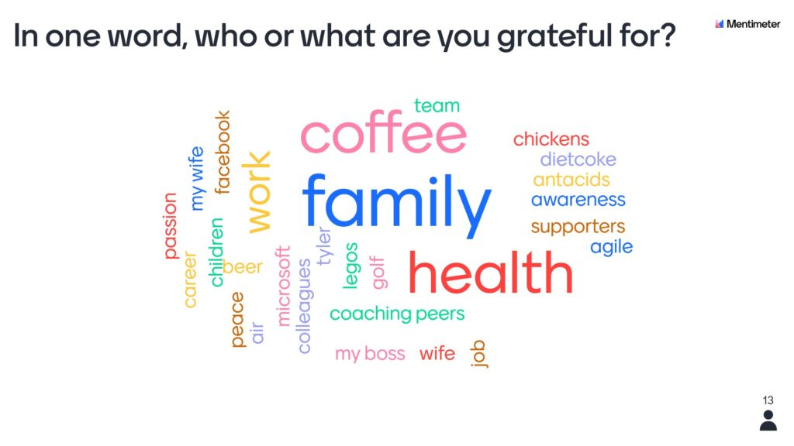
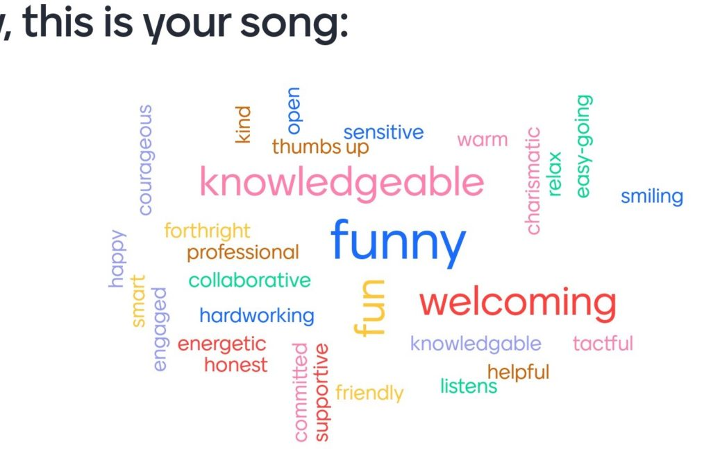
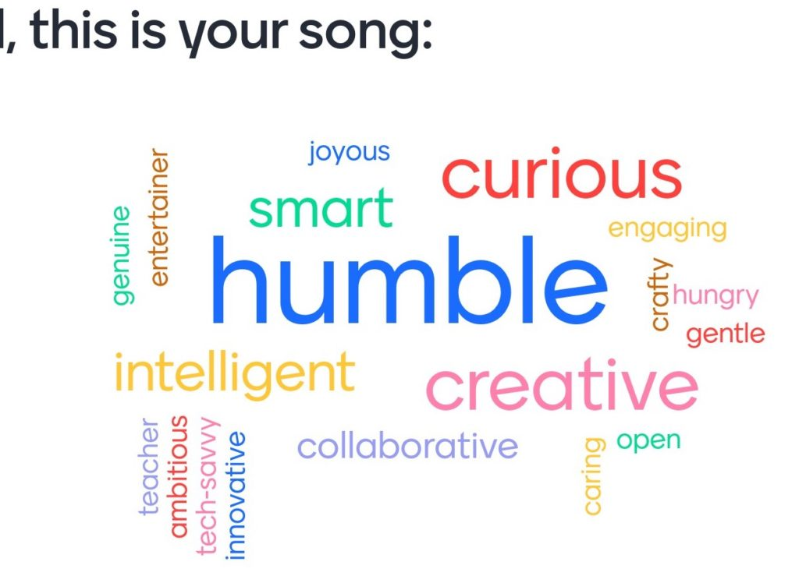
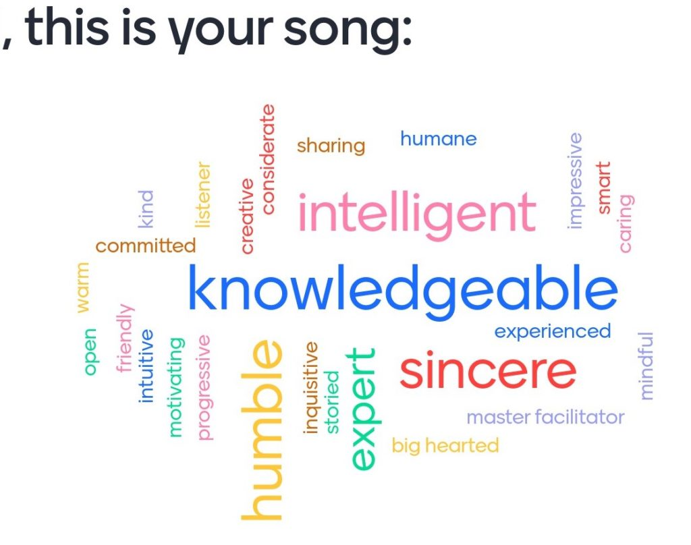

Continuing on the ideas I shared in a [previous blog post](/writing/beginning-and-ending-with-gratitude), I wanted to share a virtual version of the practice that Dr. Glenda Eoyang calls “Poems.” An exercise to express gratitude toward your team mates. In the past, I’ve done this practice with senior leaders and natural working teams, with outstanding success. And I wondered if being in proximity makes it easy and more impactful. Taking turns silently reflecting on positive attributes of one person, writing them down on post-its, and handing them as if gifts to your colleague… I felt I would miss a lot.

I finally brought up the courage to do this exercise in a Zoom world. And boy, was I proven wrong. It was still easy; it was still impactful, and the energy was still going off the charts.

I’m sharing the experience and practical steps to inspire you and make it easy for you to try.

I used Mentimeter as the primary tool and had set the expectations that we will use a smartphone, tablet, or secondary device for polling. And they knew coming in that we will do a special retrospective and team building exercise.

I started out with a warm-up question in the vein of gratitude. Meant to be light-hearted and as you can see was taken lightheartedly.

After that I had two slides to set the stage for the exercise and the prompt. Reminding them to practice the art of noticing positive attributes in others and then presenting them the following prompt:

> What is a positive attribute you would use to describe your team mate? e.g. funny, approachable, honest, radically curious etc

I would ask the person who’s name would be on the slide to be the receiver and everyone else be the senders. I asked them to write the answers and not hit submit until one-at-a-time they said what they noticed in their colleague (multiple attributes allowed.) And we created poems for each one. And here are some examples:

The feedback I received from the session was immensely validating that gratitude is an energy. When you give it in a structured or unstructured format, you build energy for yourself to use.

I had scheduled this session after the team got to each other for a month, and I had it scheduled on the last day of the week and late in the day. And you’d be forgiven, if you met them and thought the high energy is coming from a team that has just started their week and are ready to take on the world.

And I appreciate you for taking the time to read this post. And I encourage you to build more positivity and gratitude in your places of work, home, and communities!
