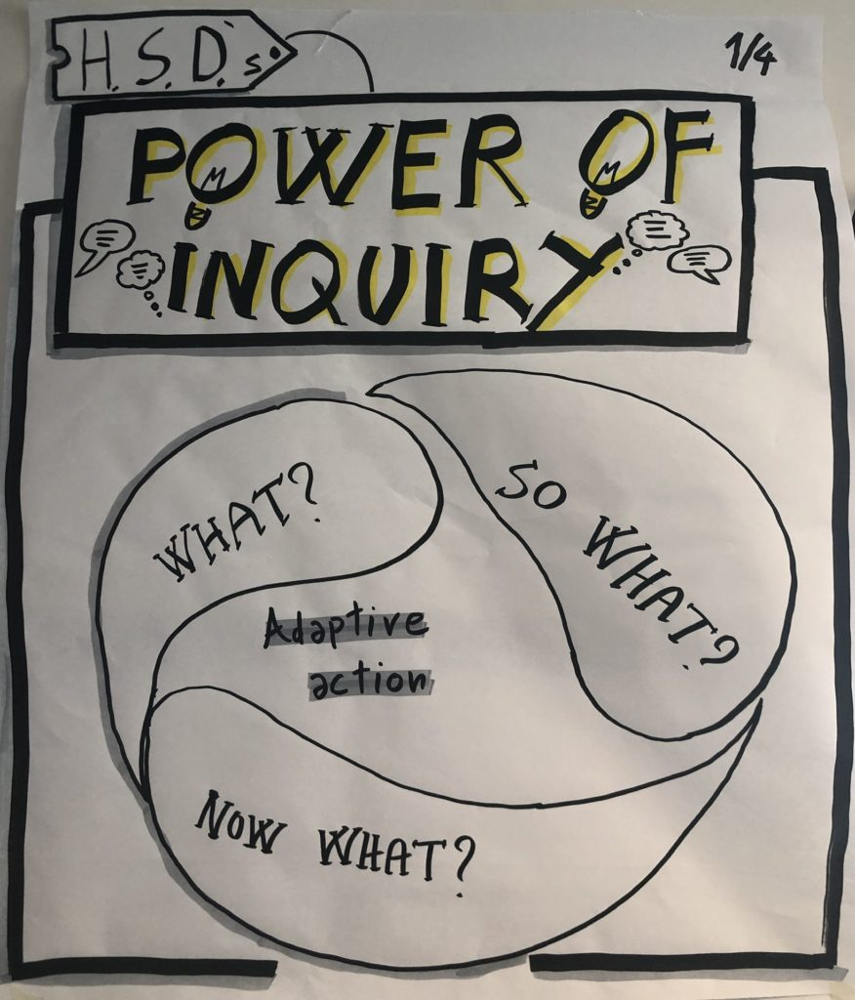
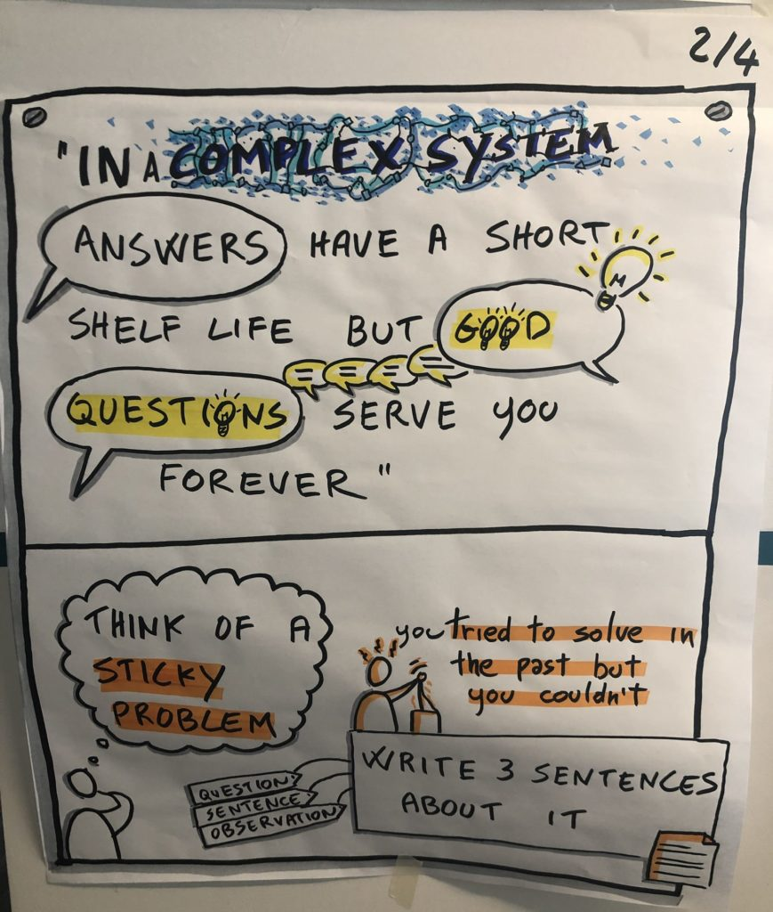
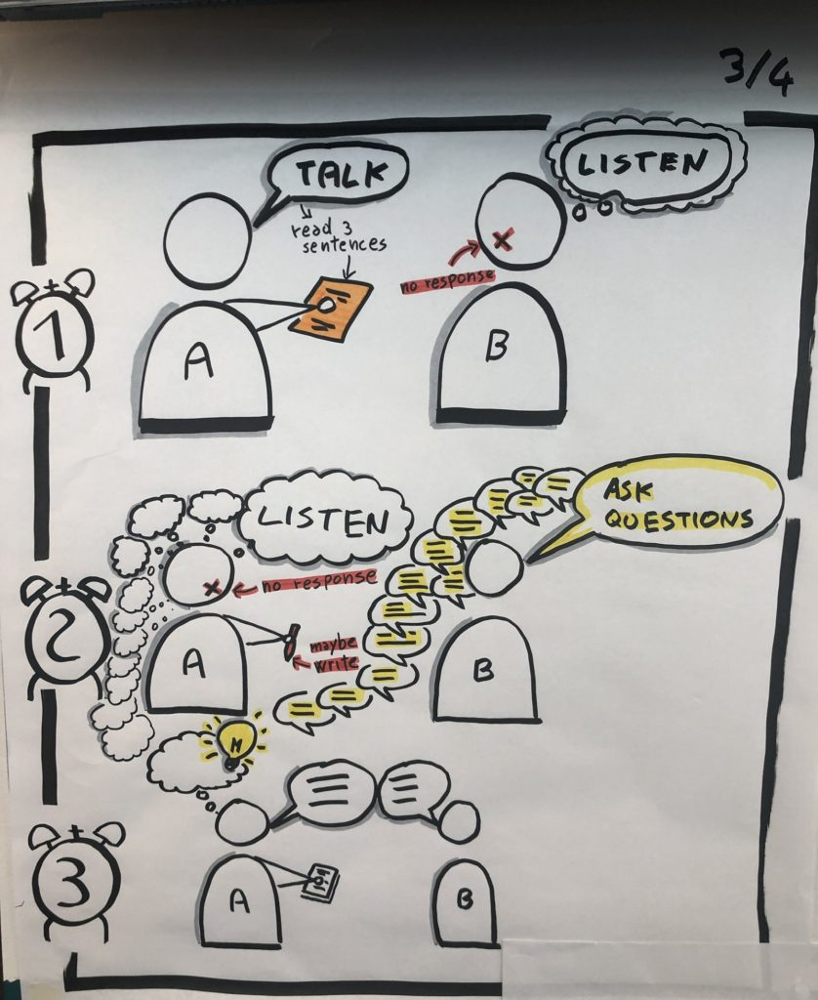
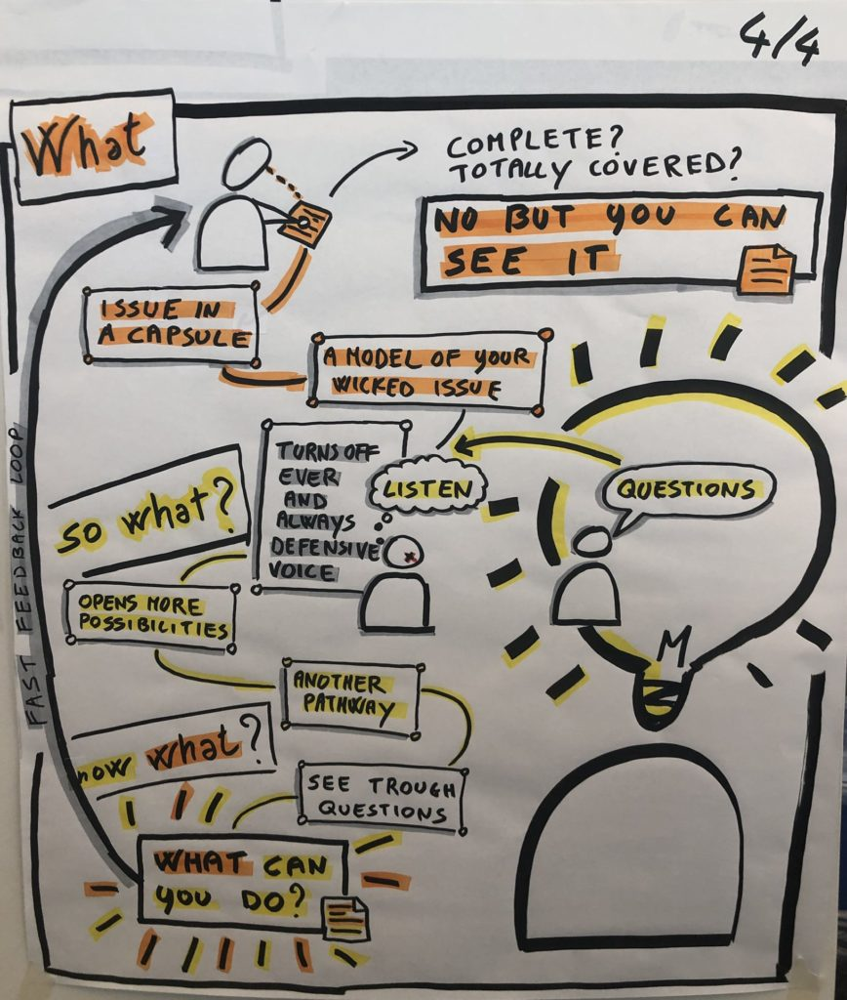

I use the power of inquiry when I’m coaching my clients or when I need to help myself get unstuck. When you hold yourself longer in inquiry, something amazing happens-new connections appear, clarity becomes tractable.

I often do it in a one-on-one setting. And although, not as frequently with a sizeable crowd, I had the privilege of holding space in Agile Open Northwest 2020 in Seattle (before the pandemic hit our shores.) Received overwhelmingly positive feedback from seasoned practitioners and coaches.

One of my dear friends, [Enrico Teotti](https://enricoteotti.com/), used his graphic recording superpowers to make a visual depiction of the event. I’ll use those below to walk you through the steps.

Just to set the stage, the practice and theory comes from Human Systems Dynamics. We believe that in a complex system answers have a short shelf-life but good questions can serve you forever. Questions that invite yes/no answers are ok. Powerful questions are better. And questions that are complexity-aware are best! An example of a complexity-aware question would be what are the [differences](https://www.hsdinstitute.org/resources/same-and-different.html) you see in a particular issue? what is a [normative truth](https://www.hsdinstitute.org/resources/four-truths.html) in this sticky issue?

So, how would you go about trying this out with a friend or a colleague?

1. Think of a sticky issue – an issue that’s on your mind, something that keeps coming back, something that seems to be intractable.
2. Write three sentences describing, possibly unique, aspects of that issue. This part is self-reflection.
3. Now for the fun part. Present the three sentences to the listener (your friend or colleague, if you’re trying it out for the first time.) The listener won’t interrupt and will hold the questions for later.
4. When you’re done presenting the questions, you’ll go into listening-only mode. For the next 3-5 minutes (or longer), your friend will ask you as many questions to fill the time. It’s important that you don’t respond to any question, including clarifying questions. If it’s hard to stay silent, scribble notes on a paper.
5. Finally, if you like, debrief on the experience. And if you’re learning together, swap roles and start over with your friend’s sticky issue.

It’s amazing what this simple structure can unlock. It’s as much of an art as it’s a science to ask the right questions. And you’ll get there with deliberate practice and tacit knowledge. Once you deepen this practice, you’ll come to appreciate what it offers and how it serves you in a rapidly changing world with adaptive actions. Inquiry is the answer!

Now what is one thing that you want to try from this practice? What sticky issue deserves your attention for a better future? What would you be your focus, yourself? Your family? Your work? Society at large?

I’d love to hear from you.
